# Jorge Suazo - Cloud Architect & FullStackDeveloper Portfolio

[🇬🇧 English](README.en.md) | [🇪🇸 Español](README.md)

Un portafolio personal completo que muestra experiencia en arquitectura de la nube, prácticas DevOps y desarrollo full-stack. Construido con tecnologías web modernas y diseñado para una presentación profesional.

## 🌟 Estudios Actuales

Actualmente inscrito en el programa **Talento Digital**, enfocado en **Fundamentos de Arquitecto Cloud** con **AWS** como plataforma principal. Este programa incluye formación en:

- Diseño e implementación de infraestructura en la nube
- Servicios de AWS y mejores prácticas
- Metodologías DevOps y automatización
- Patrones de arquitectura escalable
- Seguridad y cumplimiento en entornos cloud

## 🚀 Secciones del Portafolio

### Secciones Profesionales
- **Inicio**: Presentación profesional y resumen de habilidades
- **Proyectos**: Implementaciones reales y soluciones
- **CV**: Experiencia profesional y habilidades técnicas
- **Certificados**: Certificaciones y logros de formación

### Capacidades Técnicas
- **Plataformas Cloud**: AWS, Google Cloud Platform, Oracle Cloud Infrastructure
- **Herramientas DevOps**: Docker, Kubernetes, Terraform, CloudFormation, CI/CD
- **Programación**: Java, Spring, JavaScript, React, Vue.js, Next.js
- **Bases de Datos**: MySQL, Redis, soluciones nativas en la nube
- **Infraestructura**: Microservicios, arquitecturas serverless, orquestación de contenedores

## 🎯 Demo en Vivo
- **Sitio Web**: [https://jsuazof.github.io](https://jsuazof.github.io)
- **LinkedIn**: [https://www.linkedin.com/in/jorgesuazof](https://www.linkedin.com/in/jorgesuazof)
- **GitHub**: [https://github.com/jsuazof](https://github.com/jsuazof)

## 🛠️ Construido con
- **Astro** - Generador de sitios estáticos moderno
- **TailwindCSS** - Framework CSS utility-first
- **DaisyUI** - Librería de componentes accesibles sobre TailwindCSS
- **TypeScript** - JavaScript tipado
- **GitHub Pages** - Hosting estático con despliegue automático
- **GitHub Actions** - CI/CD para despliegue sin interrupciones

## 🏗️ Arquitectura del Proyecto

```mermaid
flowchart TD
    %% Source Artifacts
    subgraph "Source Artifacts" 
        direction TB
        MD_Content_Blog["Markdown Content (Blog)"]:::source
        MD_Content_Store["Markdown Content (Store)"]:::source
        Asset_Images["Asset Images"]:::source
        Cert_PDFs_Source["Certificate PDFs (Source)"]:::source
        Layouts_Lib["Layouts Library"]:::source
        UI_Components["UI Components Library"]:::source
        Utility_Functions["Utility Functions"]:::source
        Global_Styles["Global Styles"]:::source
        Pages["Page Entry Points (Routes)"]:::source
        Build_Config["Build Configuration"]:::source
    end

    %% Build Processes
    subgraph "Build Processes" 
        direction TB
        Astro_Engine["Astro Engine"]:::build
        Tailwind_Daisy["TailwindCSS & DaisyUI"]:::build
        Asset_Scripts["Asset Processing Scripts"]:::build
    end

    %% CI/CD
    subgraph "CI/CD Pipeline" 
        direction TB
        GH_Actions["GitHub Actions"]:::ci
    end

    %% Deployment
    subgraph "Deployment & Hosting" 
        direction TB
        Public_Output["Deployment Output (public/)"]:::deploy
        GitHub_Pages["GitHub Pages Hosting"]:::host
    end

    %% Connections
    MD_Content_Blog -->|feeds into| Astro_Engine
    MD_Content_Store -->|feeds into| Astro_Engine
    Asset_Images -->|feeds into| Astro_Engine
    Cert_PDFs_Source -->|feeds into| Asset_Scripts
    Layouts_Lib -->|used by| Astro_Engine
    UI_Components -->|used by| Astro_Engine
    Utility_Functions -->|used by| Astro_Engine
    Global_Styles -->|applied by| Tailwind_Daisy
    Pages -->|defines routes for| Astro_Engine
    Build_Config -->|configures| Astro_Engine

    Astro_Engine -->|generates static files| Public_Output
    Tailwind_Daisy -->|processes CSS| Public_Output
    Asset_Scripts -->|processes assets| Public_Output

    Public_Output -->|deployed by| GH_Actions
    GH_Actions -->|publishes| GitHub_Pages

    GitHub_Pages -->|serves site| End_Users["End Users"]

    %% Click Events
    click MD_Content_Blog "https://github.com/jsuazof/jsuazof.github.io/tree/master/src/content/blog/"
    click MD_Content_Store "https://github.com/jsuazof/jsuazof.github.io/tree/master/src/content/store/"
    click Asset_Images "https://github.com/jsuazof/jsuazof.github.io/tree/master/src/assets/images/"
    click Cert_PDFs_Source "https://github.com/jsuazof/jsuazof.github.io/tree/master/src/assets/images/certificates/"
    click Layouts_Lib "https://github.com/jsuazof/jsuazof.github.io/tree/master/src/layouts/"
    click UI_Components "https://github.com/jsuazof/jsuazof.github.io/tree/master/src/components/"
    click Utility_Functions "https://github.com/jsuazof/jsuazof.github.io/blob/master/src/lib/createSlug.ts"
    click Global_Styles "https://github.com/jsuazof/jsuazof.github.io/blob/master/src/styles/global.css"
    click Pages "https://github.com/jsuazof/jsuazof.github.io/blob/master/src/pages/index.astro"
    click Build_Config "https://github.com/jsuazof/jsuazof.github.io/blob/master/astro.config.mjs"
    click Asset_Scripts "https://github.com/jsuazof/jsuazof.github.io/tree/master/scripts/"
    click GH_Actions "https://github.com/jsuazof/jsuazof.github.io/blob/master/.github/workflows/deploy.yml"
    click Public_Output "https://github.com/jsuazof/jsuazof.github.io/tree/master/public/"
    click GitHub_Pages "https://github.com/jsuazof/jsuazof.github.io/blob/master/.nojekyll"

    %% Styles
    classDef source fill:#BBE1FA,stroke:#1B4965,color:#1B4965
    classDef build fill:#B2F2BB,stroke:#2D6A4F,color:#2D6A4F
    classDef ci fill:#FFD8A8,stroke:#E8590C,color:#E8590C
    classDef deploy fill:#F0C0FC,stroke:#9D4EDD,color:#9D4EDD
    classDef host fill:#F0C0FC,stroke:#9D4EDD,color:#9D4EDD
```

## 🌐 Despliegue
Este portafolio se despliega automáticamente en GitHub Pages usando GitHub Actions.

1. **Build**: Compilación y optimización con Astro  
2. **Validación**: Pruebas y chequeos de calidad  
3. **Despliegue**: Publicación con cero tiempo de inactividad

## 📧 Contacto
- **Email**: jsuazof@gmail.com
- **LinkedIn**: [Jorge Suazo](https://www.linkedin.com/in/jorgesuazof)
- **GitHub**: [jsuazof](https://github.com/jsuazof)

---

*Portafolio profesional con más de 30 años de experiencia en TI, especializado en arquitectura cloud, DevOps y desarrollo full-stack.*
